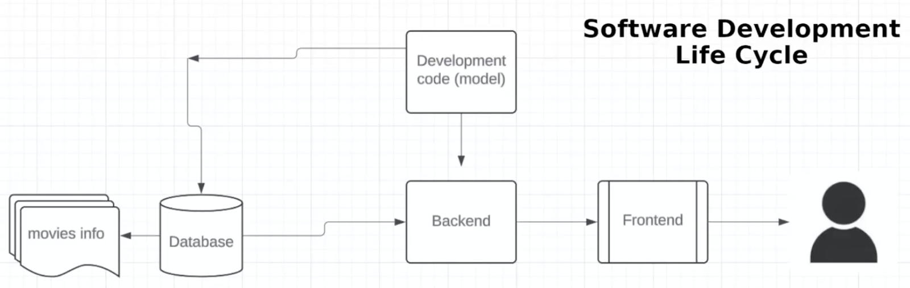

# MLOps Design Considerations

## Agenda

1. **Introduction and Overview of MLOps**
2. **Introduction to AWS and Cloud Computing**
3. **Top Products Demo in AWS**
   - Model Monitoring
   - ML Solutions Available in AWS

---

# Introduction to MLOps

## MLOps Mind Map

- **Key Components:**
  - **Data Management**
  - **Model Training**
  - **Model Deployment**
  - **Kubernetes**
  - **Monitoring and Logging**
  - **Security and Governance**

- **Roles and Pathways:**
  - MLOps engineers can specialize in various areas.
  - MLOps is essential for integrating ML products into existing ecosystems.

- **Career Insights:**
  - MLOps is a rapidly growing field due to the rise of AI as a service.
  - Skills in data management, security, and model deployment are highly sought after.

## Why Not Run Notebooks in Production?

1. **Version Control:**
   - Difficult to track changes and perform merges.
   - The cell-based structure complicates versioning.

2. **Execution Order:**
   - Out-of-order execution leads to unpredictability.
   - Variables can be defined in any order, causing inconsistent results.

3. **Modular Code:**
   - Notebooks often lack modularity, making code reuse challenging.

4. **Testing and Code Reviews:**
   - Difficult to implement testing frameworks.
   - Challenging to perform thorough code reviews.

5. **Deployment Complexity:**
   - Not designed for production environments.
   - Issues with packaging and deploying notebooks.

6. **Environment Consistency:**
   - Dependency management is complex.
   - Environments may be inconsistent between development and production.

7. **Orchestration and Logging:**
   - Difficult to orchestrate workflows.
   - Limited logging capabilities for monitoring.

8. **Security Concerns:**
   - Notebooks may expose sensitive data.
   - Lack proper authentication and authorization mechanisms.

### Importance of MLOps

- **Consistency and Reliability:**
  - Ensures predictable model behavior in production.
  - *Example:* Uber Eats delivery time predictions must be accurate.

- **Reproducibility:**
  - Ability to reproduce results across different environments.

- **Scaling from POC to Production:**
  - Transitioning from proof-of-concept to scalable, maintainable systems.

- **End-to-End Management:**
  - MLOps covers the entire lifecycle from data ingestion to model deployment.

---

# Netflix Movie Recommender Example

## Problem Statement

- **Goal:** Develop a movie recommender system for Netflix.
- **Approach:**
  - **Scenario 1:** Recommend movies based on ratings (Rule-Based System).
  - **Scenario 2:** Provide personalized recommendations (ML-Based System).

## Scenario 1: Rule-Based System

### Architecture Diagram

- **Components:**
  - **Database:** Stores all movie information.
  - **Model:** Business rules (e.g., movies rated 4 stars or above).
  - **Backend and Frontend:** User interface for displaying recommendations.

### Characteristics

- **Static System:**
  - Provides the same recommendations to all users.

- **Simplicity:**
  - Easier to implement and maintain.

- **Limitations:**
  - Lacks personalization.
  - Does not adapt to individual user preferences.

- **Example Rules:**
  - Top 10 highest-rated movies.
  - Movies rated 4 stars or higher, sorted alphabetically.

### DevOps Perspective

- **Focus:** Software Development Lifecycle (SDLC).
- **Maintenance:** Stable, predictable systems.
- **Updates:** Manual rule changes as needed.

## Scenario 2: ML-Based System

### Architecture Diagram

- **Components:**
  1. **Data Sources:**
     - **Movie Database:** Movie details and ratings.
     - **User Data API:** User interactions and preferences.
  2. **Data Warehouse:**
     - Combines movie and user data for comprehensive analysis.
  3. **ML Training Pipeline:**
     - **Data Preprocessing:** Clean and prepare data.
     - **Model Training:** Develop ML models.
     - **Evaluation:** Assess model performance.
     - **Deployment:** Move models to production.
  4. **Model Continuous Training:**
     - Regular updates to models with new data.
     - Addresses model drift.
  5. **Backend and Frontend:**
     - Interfaces for user interaction.

### Characteristics

- **Dynamic System:**
  - Provides personalized recommendations for each user.

- **Complexity:**
  - Multiple data sources and types (CSV, JSON, text).
  - More components and moving parts.

- **Continuous Improvement:**
  - Models adapt over time based on new data.
  - Reflects changing user behavior (e.g., seasonal interests).

- **Data Types:**
  - **Structured Data:** CSV files.
  - **Semi-Structured Data:** JSON files.
  - **Unstructured Data:** Text and images (JPEGs).

### MLOps Perspective

- **Challenges:**
  - Managing data ingestion from various sources.
  - Ensuring data quality and consistency.
  - Orchestrating complex workflows.

- **Benefits:**
  - Enhanced user experience through personalization.
  - Ability to adapt to new trends and preferences.

- **Key Processes:**
  - **ETL (Extract, Transform, Load):** Data preparation steps.
  - **Experimentation:** Using notebooks for model development.
  - **Production Deployment:** Moving models into production environments.

## Comparing DevOps and MLOps

### DevOps

- **Definition:** Practices combining software development (Dev) and IT operations (Ops).
- **Focus:**
  - Software release management.
  - Infrastructure provisioning.
  - Continuous Integration/Continuous Deployment (CI/CD).
- **Characteristics:**
  - Stable, predictable systems.
  - Manual updates to rules or code.

### MLOps

- **Definition:** Extension of DevOps principles to include Machine Learning workflows.
- **Focus:**
  - Managing the ML lifecycle.
  - Data management and versioning.
  - Model deployment and monitoring.
- **Characteristics:**
  - Dynamic, data-driven systems.
  - Continuous model training and deployment.
  - Handles model drift and data changes.

### Key Differences

- **Data Complexity:**
  - MLOps handles large, diverse datasets.

- **Model Lifecycle:**
  - Continuous training and evaluation in MLOps.

- **System Behavior:**
  - MLOps systems are adaptive; DevOps systems are more static.

- **Maintenance:**
  - MLOps requires monitoring model performance over time.

### Key Takeaways

- **Increased Complexity:**
  - MLOps introduces new components (e.g., data pipelines, training pipelines).

- **Continuous Updates:**
  - Models require regular retraining with new data.

- **ABU (Always Be Updating):**
  - Emphasis on keeping models current and relevant.

- **Adaptability:**
  - Systems can adjust to user behavior and trends without manual intervention.

---

## Deploying Models Without APIs

- **Question:** How are models deployed in systems where APIs cannot be used, such as payment fraud detection?
- **Answer:**
  - **On-Edge Deployment:**
    - Deploy models directly on the device or system.
  - **Microservices:**
    - Wrap models as microservices within the application.
  - **Unified Interface Engines:**
    - Use tools like TensorFlow Serving, TorchServe, or ONNX Runtime.
  - **SDKs and Libraries:**
    - Integrate models using software development kits.
  - **Batch Processing:**
    - Utilize batch jobs for non-real-time inference.

---

# MLOps System Design

## Deployment Strategies

### Deploying Models Without APIs

- **Direct Deployment:**
  - Models can be deployed directly to end devices.
  - Example: Fraud detection systems where APIs cannot be used.

- **Library Deployment:**
  - Models packaged as libraries for integration.

- **MLOps Flexibility:**
  - MLOps engineers craft deployment solutions that meet specific requirements.
  - Deployment types differ significantly from static deployments in DevOps.

## Continuous Improvement in MLOps

- **No Perfect Model:**
  - ML models require continuous improvement; there is no "perfect" model.
  - User preferences change over time (e.g., movies watched in October vs. December).

- **Importance of External Data:**
  - ML models should not rely solely on static databases.
  - Continuous data ingestion is necessary for model relevance.

## Building and Deploying Models

- **Building an Image and Deploying:**
  - **Containerization:**
    - Use Docker to create a self-contained executable image.
    - Dockerfile defines the environment and dependencies.
  - **Deployment:**
    - Use orchestration platforms like Kubernetes.
    - Steps:
      1. **Containerize** the model with Docker.
      2. **Deploy** the Docker image using Kubernetes.

## Responsibilities in MLOps

- **Execution on Edge Devices:**
  - **Split Responsibility:**
    - MLOps engineers monitor, update, and maintain models.
    - Engineering teams handle execution and testing on devices.

## System Design in MLOps

### High-Level Overview

- **Complex Pipelines:**
  - MLOps involves orchestrating complex ML pipelines.
  - Example: Machine learning pipeline in a healthcare setting.

- **Components:**
  - **Data Extraction:**
    - Multiple data inputs (e.g., encryption servers, data sources).
  - **Workflow Orchestration:**
    - Tools like Airflow and Jenkins automate the pipeline.
  - **Model Training:**
    - Use tools like XGBoost, PyTorch, Pandas.
  - **Deployment:**
    - Serving inferences to downstream systems.

- **MLOps Role:**
  - Responsible for orchestration, data management, and serving predictions.
  - Acts as a support system for ML experiences and engineering.

## MLOps Tools and Technologies

- **Common Tools:**
  - **Cloud Platforms:**
    - AWS, Azure, GCP.
  - **Infrastructure as Code:**
    - Tools for automating infrastructure provisioning.
  - **CI/CD:**
    - Jenkins, Bitbucket.
  - **Monitoring and Logging:**
    - Splunk.

- **Maturity of MLOps:**
  - MLOps is a relatively new field.
  - Terminology and tools may vary across companies.

## ETL and Feature Engineering

- **ETL (Extract, Transform, Load):**
  - Typically managed by data engineering teams.
  - Not usually a direct responsibility of MLOps engineers.

- **Feature Engineering:**
  - Part of the modeling process.
  - Decisions made by ML engineering teams.

## Standardization in MLOps

- **Goal:**
  - Provide technologies, processes, and standardization.
  - Minimize disruptions and ensure reliable customer experiences.

---

## MLOps Lifecycle

### Phases and Activities

1. **ML Development:**
   - Experimentation and prototyping of models.
   - Output: Formalized training procedures.

2. **Training Operationalization:**
   - Creating robust training pipelines based on ML engineers' requirements.

3. **Continuous Training:**
   - Regularly updating models with new data.
   - Ensures models remain relevant over time.

4. **Model Deployment:**
   - Deploying updated models into production environments.

5. **Prediction Serving:**
   - Serving predictions to applications and users.

6. **Continuous Monitoring:**
   - Monitoring model performance and detecting issues.
   - Triggers retraining if performance degrades.

### Data and Model Management

- **Data Versioning:**
  - Partitioning data by time, region, or user.
  - Associates specific data versions with model versions.
  - *Example:*
    - **V1 Data:** October 2024 (Halloween model).
    - **V2 Data:** December 2024 (Christmas model).

- **Importance:**
  - Ensures consistency between data and models.
  - Facilitates retraining and model updates.

## Differences Between ML Models

### Classic ML vs. Deep Learning vs. RAG

- **Classic Machine Learning:**
  - **Steps:**
    1. Collect Data
    2. Preprocess Data
    3. Feature Engineering
    4. Model Selection and Training
    5. Evaluation
    6. Deployment
  - **Characteristics:**
    - Manual feature engineering.
    - Less computationally intensive.

- **Deep Learning:**
  - **Steps:**
    1. Collect Data
    2. Preprocess Data
    3. Automatic Feature Extraction
    4. Model Training
    5. Evaluation
    6. Deployment
  - **Characteristics:**
    - Uses CNNs, RNNs, Transformers.
    - Automatic feature extraction.
    - More resource-intensive.
    - Requires careful resource management in MLOps.

- **Retrieval-Augmented Generation (RAG):**
  - **Steps:**
    1. Retrieve Relevant Information
       - Use APIs, vector databases (e.g., BM25, DPR).
    2. Embed Data
    3. Process with Large Language Models (LLMs)
    4. Generate Output
  - **Characteristics:**
    - Combines multiple models and technologies.
    - MLOps focuses on orchestrating components rather than owning models.

## Monitoring Model Performance

- **Detecting Model Degradation:**
  - **Data Drift Detection:**
    - Monitoring changes in data distribution.
  - **Model Drift Detection:**
    - Evaluating model performance on holdout test sets over time.
  - **Proxy Metrics:**
    - Confidence levels, anomaly detection.
  - **Feedback Loops:**
    - Incorporating manual labeling or expert review when necessary.

## Variety of MLOps Tools

- **Categories:**
  - **All-in-One Platforms:**
    - Azure ML, AWS SageMaker.
  - **Data Sources and Storage:**
    - Data warehouses, data lakes.
  - **Versioning and Labeling:**
    - Tools for data versioning and annotation.
  - **Training and Deployment:**
    - Various tools based on organizational needs.

- **Recommendation:**
  - Focus on tools used by your organization.
  - Build proficiency in relevant tools for practical application.

## DevOps and MLOps Integration

### DevOps Loop

- **Phases:**
  - Plan → Code → Build → Test → Release → Operate → Monitor → Plan (continuous cycle).

- **Purpose:**
  - Combines development and operations for faster delivery.
  - Automates building, testing, and releasing software.

### CI/CD in DevOps

- **Continuous Integration (CI):**
  - Automates code integration and testing.
- **Continuous Deployment (CD):**
  - Automates software deployment to production.
- **Benefits:**
  - Faster iteration.
  - Improved stability.
  - Collaboration across development, operations, and QA.

### CI/CD/CT in MLOps

- **Adds Continuous Training (CT):**
  - Regularly retrains models with new data.
- **Changes in CI/CD:**
  - **CI:**
    - Validates not just code but also data, schemas, and models.
  - **CD:**
    - Focuses on deploying ML training pipelines and services.

## Case Study: Uber's Michelangelo Platform

- **Use Case:**
  - Predicting delivery times for Uber Eats.
- **Factors Considered:**
  - Order preparation time.
  - Driver availability and location.
  - Traffic conditions.
- **Scale:**
  - Millions of users and daily inferences.
- **MLOps Challenges:**
  - Requires robust infrastructure to handle real-time predictions.
  - Continuous model updates to reflect changing conditions.

## Amazon SageMaker

- **Overview:**
  - All-in-one MLOps platform by AWS.
  - Covers the entire ML lifecycle from development to deployment.
- **Features:**
  - Model development tools.
  - Training and tuning capabilities.
  - Deployment and hosting services.
- **Ideal For:**
  - Small to medium businesses.
  - Organizations seeking quick ML capabilities without building from scratch.

---
