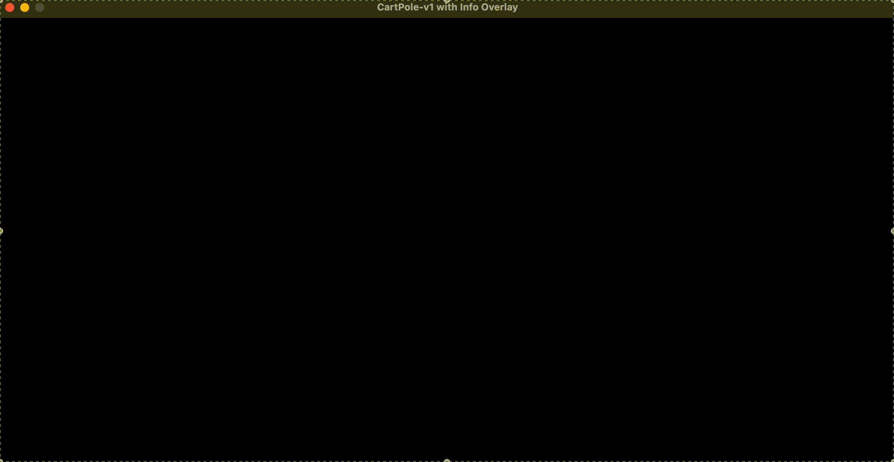

# Understanding Reinforcement Learning with the CartPole Example



*Reinforcement Learning (RL)* is an area of machine learning where an **agent** learns to make optimal decisions by interacting with an **environment**. Unlike supervised learning, which relies on labeled datasets, RL agents learn by trial and error, receiving feedback in the form of rewards or penalties. The objective is to determine the best sequence of actions that maximizes cumulative rewards.

This document delves into the core concepts of reinforcement learning using the classic **CartPole** example. It explores how the provided `cartpole.py` script embodies these concepts and sets the foundation for building intelligent agents.

---

## Key Concepts in Reinforcement Learning

Before analyzing the script, it's important to familiarize with the fundamental components of reinforcement learning:

1. **Agent**: The entity that makes decisions and learns from experiences. In this example, the agent is the algorithm that chooses actions.

2. **Environment**: The world through which the agent interacts. It provides feedback in response to the agent's actions.

3. **State**: A snapshot of the environment at a particular time. It contains all the information the agent needs to make decisions.

4. **Action**: An operation the agent can perform, affecting the state of the environment.

5. **Reward**: Feedback from the environment in response to an action. The agent's goal is to maximize the cumulative reward over time.

6. **Policy**: A strategy used by the agent to decide the next action based on the current state.

7. **Value Function**: Estimates how good a particular state or action is in terms of expected future rewards.

8. **Episode**: A sequence of states, actions, and rewards that ends in a terminal state. For example, when the pole falls or the cart moves out of bounds.

Understanding these concepts is crucial as they form the backbone of any RL algorithm.

---

## `cartpole.py` Script

The `cartpole.py` script is a practical implementation that sets up the CartPole environment using OpenAI Gymnasium's `CartPole-v1`, visualizes it with Pygame, and runs multiple episodes where the agent takes actions. Although the agent currently selects actions randomly, this script provides a solid foundation for implementing learning algorithms.

```python
import gymnasium as gym
import pygame
import sys
import numpy as np

# Initialize Pygame and environment
def initialize_game():
    pygame.init()
    env = gym.make("CartPole-v1", render_mode="rgb_array")
    return env

# Set up Pygame display
def setup_display():
    env_width, env_height = 800, 600
    stats_width = 400
    screen_width, screen_height = env_width + stats_width, env_height
    screen = pygame.display.set_mode((screen_width, screen_height))
    pygame.display.set_caption("CartPole-v1 with Info Overlay")
    return screen, env_width, stats_width, screen_height

# Function to render text on the Pygame window
def render_text(screen, text, position, font_size=24, color=(255, 255, 255)):
    font = pygame.font.Font(None, font_size)
    text_surface = font.render(text, True, color)
    screen.blit(text_surface, position)

# Function to draw a semi-transparent background
def draw_transparent_box(screen, position, size, color=(0, 0, 0), alpha=128):
    s = pygame.Surface(size, pygame.SRCALPHA)
    s.fill((*color, alpha))
    screen.blit(s, position)

# Render game state
def render_game_state(screen, env_image, env_width, stats_width, screen_height, episode, step, action, reward, cumulative_reward, next_state, done):
    # Render the environment
    env_surface = pygame.surfarray.make_surface(env_image.swapaxes(0, 1))
    screen.blit(env_surface, (0, 0))

    # Draw semi-transparent background for stats on the right side
    draw_transparent_box(screen, (env_width, 0), (stats_width, screen_height), color=(0, 0, 0), alpha=180)

    # Render stats on the right side
    render_text(screen, f"Episode: {episode + 1}", (env_width + 20, 20))
    render_text(screen, f"Step: {step}", (env_width + 20, 60))
    render_text(screen, f"Action: {action} ({'Left' if action == 0 else 'Right'})", (env_width + 20, 100))
    render_text(screen, f"Reward: {reward:.2f}", (env_width + 20, 140))
    render_text(screen, f"Cumulative Reward: {cumulative_reward:.2f}", (env_width + 20, 180))

    # Display state information
    render_text(screen, "State:", (env_width + 20, 230))
    render_text(screen, f"  Cart Position: {next_state[0]:.4f}", (env_width + 20, 270))
    render_text(screen, f"  Cart Velocity: {next_state[1]:.4f}", (env_width + 20, 310))
    render_text(screen, f"  Pole Angle: {next_state[2]:.4f} rad ({np.degrees(next_state[2]):.2f}°)", (env_width + 20, 350))
    render_text(screen, f"  Pole Angular Velocity: {next_state[3]:.4f}", (env_width + 20, 390))

    # Display termination conditions
    render_text(screen, "Termination Conditions:", (env_width + 20, 440))
    render_text(screen, f"  |Cart Position| < 2.4: {abs(next_state[0]) < 2.4}", (env_width + 20, 480))
    render_text(screen, f"  |Pole Angle| < 12°: {abs(np.degrees(next_state[2])) < 12}", (env_width + 20, 520))

    if done:
        reason = "Pole fell or cart out of bounds" if isinstance(done, bool) else "Max steps reached"
        render_text(screen, f"Episode ended: {reason}", (env_width + 20, 560), color=(255, 0, 0))

    # Update the full display
    pygame.display.flip()

# Main game loop
def run_episode(env, screen, env_width, stats_width, screen_height, episode):
    state, _ = env.reset()
    done = False
    cumulative_reward = 0
    step = 0

    while not done:
        # Handle Pygame events
        for event in pygame.event.get():
            if event.type == pygame.QUIT:
                return None

        action = env.action_space.sample()  # Take a random action
        next_state, reward, terminated, truncated, info = env.step(action)

        done = terminated or truncated
        cumulative_reward += reward
        step += 1

        # Render the environment
        env_image = env.render()

        render_game_state(screen, env_image, env_width, stats_width, screen_height, episode, step, action, reward, cumulative_reward, next_state, done)

        state = next_state

    return cumulative_reward

# Main function
def main():
    env = initialize_game()
    screen, env_width, stats_width, screen_height = setup_display()
    clock = pygame.time.Clock()
    fps = 30

    num_episodes = 5
    for episode in range(num_episodes):
        episode_reward = run_episode(env, screen, env_width, stats_width, screen_height, episode)

        if episode_reward is None:  # User closed the window
            break

        # Short pause between episodes
        pygame.time.wait(1000)

    env.close()
    pygame.quit()

if __name__ == "__main__":
    main()
```

## Explanation of the Script

Examining the script step by step reveals how it incorporates key RL concepts.

### 1. Environment and Game Initialization

First, the script initializes the game environment and sets up the display using Pygame.

```python
def initialize_game():
    pygame.init()
    env = gym.make("CartPole-v1", render_mode="rgb_array")
    return env
```

- **Environment Initialization**: Creates the CartPole environment, simulating a cart moving along a track with a pole attached by an unactuated joint.

- **Render Mode**: Setting `render_mode` to `"rgb_array"` allows capturing the environment's visual state for rendering.

```python
def setup_display():
    env_width, env_height = 800, 600
    stats_width = 400
    screen_width, screen_height = env_width + stats_width, env_height
    screen = pygame.display.set_mode((screen_width, screen_height))
    pygame.display.set_caption("CartPole-v1 with Info Overlay")
    return screen, env_width, stats_width, screen_height
```

- **Display Configuration**: Sets up the Pygame window dimensions and initializes the display where the environment and stats will be rendered.

---

### 2. Main Execution Loop

The `main()` function orchestrates the entire execution by running multiple episodes.

```python
def main():
    env = initialize_game()
    screen, env_width, stats_width, screen_height = setup_display()
    clock = pygame.time.Clock()
    fps = 30

    num_episodes = 5
    for episode in range(num_episodes):
        episode_reward = run_episode(env, screen, env_width, stats_width, screen_height, episode)

        if episode_reward is None:  # User closed the window
            break

        # Short pause between episodes
        pygame.time.wait(1000)

    env.close()
    pygame.quit()
```

- **Episode Management**: Runs a loop for a specified number of episodes. Each episode represents a complete run from the initial state to a terminal state.

- **Environment Closure**: Ensures resources are properly released after running.

---

### 3. Episode Execution and Agent Interaction

The `run_episode()` function simulates one complete episode, where the agent interacts with the environment at each step.

```python
def run_episode(env, screen, env_width, stats_width, screen_height, episode):
    state, _ = env.reset()
    done = False
    cumulative_reward = 0
    step = 0

    while not done:
        # Handle Pygame events
        for event in pygame.event.get():
            if event.type == pygame.QUIT:
                return None  # Exit if the window is closed

        action = env.action_space.sample()  # Randomly select an action (0 or 1)
        next_state, reward, terminated, truncated, info = env.step(action)

        done = terminated or truncated
        cumulative_reward += reward
        step += 1

        # Render the environment state
        env_image = env.render()
        render_game_state(screen, env_image, env_width, stats_width, screen_height, episode, step, action, reward, cumulative_reward, next_state, done)

        state = next_state

    return cumulative_reward
```

- **State Reset**: Initializes the environment at the beginning of each episode.

- **Action Selection**: The agent chooses an action. Currently, it's selected randomly using `env.action_space.sample()`.

- **Environment Step**: The agent takes the action, and the environment returns the next state, reward, and status flags (`terminated`, `truncated`).

- **Reward Accumulation**: Sums the reward obtained in each step to track the total reward for the episode.

- **Visualization**: Updates the Pygame window with the current state and statistics using `render_game_state()`.

---

### 4. Rendering and Visualization

The following functions handle the display of the environment and statistical information.

#### Rendering the Game State

```python
def render_game_state(screen, env_image, env_width, stats_width, screen_height, episode, step, action, reward, cumulative_reward, next_state, done):
    # Rendering code here
```

- **Environment Visualization**: Converts the environment's image into a format suitable for Pygame and displays it.

- **Stats Overlay**: Draws a semi-transparent overlay to display information such as episode number, step count, action taken, reward, cumulative reward, state variables, and termination conditions.

---

#### Additional Utility Functions

- **Rendering Text**

```python
def render_text(screen, text, position, font_size=24, color=(255, 255, 255)):
    font = pygame.font.Font(None, font_size)
    text_surface = font.render(text, True, color)
    screen.blit(text_surface, position)
```

Displays text on the screen with specified font size and color.

- **Drawing Transparent Box**

```python
def draw_transparent_box(screen, position, size, color=(0, 0, 0), alpha=128):
    s = pygame.Surface(size, pygame.SRCALPHA)
    s.fill((*color, alpha))
    screen.blit(s, position)
```

Creates a background for the text with adjustable transparency.

---

## How This Example Illustrates Reinforcement Learning

The `cartpole.py` script embodies core principles of reinforcement learning, setting the stage for developing intelligent agents.

### Agent-Environment Interaction

- **Agent**: The decision-maker in the RL framework. Currently, it selects actions randomly but represents where learning algorithms can be implemented.

- **Environment**: The CartPole simulation provides a dynamic environment with specific physics and rules.

### State and Action Spaces

- **State Variables**:

  - **Cart Position**: Horizontal position of the cart.

  - **Cart Velocity**: Speed and direction of the cart.

  - **Pole Angle**: Angle of the pole relative to vertical.

  - **Pole Angular Velocity**: Rate of change of the pole's angle.

- **Actions**:

  - **Action 0**: Apply force to move the cart left.

  - **Action 1**: Apply force to move the cart right.

### Rewards and Goals

- **Reward Structure**: The agent receives a reward of `+1` for every time step the pole remains balanced.

- **Goal**: Maximize cumulative reward by keeping the pole upright for as long as possible.

### Episodes and Termination

An episode ends when:

- The pole's angle exceeds 12 degrees from vertical.

- The cart moves beyond the allowed horizontal position (`±2.4` units).

- The maximum number of steps is reached (usually 500 for CartPole-v1).

---

### Moving Towards an Intelligent Agent

Currently, the agent acts randomly. To create a learning agent:

1. **Implement a Policy**: Instead of random actions, use a policy that selects actions based on maximizing expected rewards.

2. **Incorporate a Learning Algorithm**: Use methods like **Q-Learning** or **Deep Q-Networks (DQN)** to update the policy based on experiences.

3. **Experience Replay and Updates**: Store experiences and use them to train the agent's value function or policy network.

4. **Balance Exploration and Exploitation**: Implement strategies to explore new actions while exploiting known rewarding actions.

By enabling the agent to learn from interactions, it will start to improve performance, balancing the pole for longer periods.

---

## Conclusion

The `cartpole.py` script provides a comprehensive foundation for understanding the mechanics of reinforcement learning. By simulating the CartPole environment and allowing an agent to interact with it step by step, the script illustrates essential RL concepts:

- **Agent and Environment Interaction**

- **State and Action Spaces**

- **Reward Accumulation**

- **Episode Management**

While the agent currently acts randomly, the structure is in place to implement learning algorithms that can greatly enhance performance. This example serves as a stepping stone towards creating intelligent agents capable of learning and adapting through reinforcement learning techniques.

---

## Further Steps

To transform this script into a learning agent, consider the following roadmap:

1. **Choose an RL Algorithm**:

   - **Q-Learning**: A value-based method that learns the value of action-state pairs.

   - **Deep Q-Networks (DQN)**: Combines Q-Learning with deep neural networks to handle complex state spaces.

   - **Policy Gradients**: Directly learn the policy that maps states to actions.

2. **Implement the Learning Algorithm**:

   - Replace the random action selection with actions derived from the policy.

   - Initialize a neural network (for DQN) or a Q-table (for tabular methods).

3. **Experience Replay (for DQN)**:

   - Store experiences in a replay buffer to break correlations between sequential data.

4. **Train the Agent**:

   - Run numerous episodes to allow the agent to learn from accumulated experiences.

5. **Evaluate and Adjust**:

   - Monitor performance metrics like cumulative rewards and episode lengths.

   - Tune hyperparameters (learning rate, discount factor, exploration rate).

6. **Optimization Techniques**:

   - Implement strategies like target networks, double DQN to stabilize training.

By following these steps, the foundation laid by the `cartpole.py` script can be converted into a powerful learning agent capable of mastering the CartPole task.

---

## Resources

- **OpenAI Gymnasium Documentation**: [https://gymnasium.farama.org/](https://gymnasium.farama.org/)

- **Reinforcement Learning: An Introduction** by Sutton and Barto: [http://incompleteideas.net/book/the-book-2nd.html](http://incompleteideas.net/book/the-book-2nd.html)

- **Deep Q-Networks Tutorials**:

  - TensorFlow Tutorial: [https://www.tensorflow.org/agents/tutorials/1_dqn_tutorial](https://www.tensorflow.org/agents/tutorials/1_dqn_tutorial)

  - PyTorch Tutorial: [https://pytorch.org/tutorials/intermediate/reinforcement_q_learning.html](https://pytorch.org/tutorials/intermediate/reinforcement_q_learning.html)

- **Pygame Documentation**: [https://www.pygame.org/docs/](https://www.pygame.org/docs/)

---

## Summary

Reinforcement Learning offers a powerful framework for agents to make decisions and learn from interactions within an environment. The CartPole example provides a tangible context to understand and implement these concepts. By comprehensively analyzing and running the `cartpole.py` script, one can gain insight into how agents perceive states, select actions, receive rewards, and progress through episodes.

This example sets the stage for more advanced implementations, where agents don't just act randomly but learn optimal policies that maximize rewards over time. By layering learning algorithms onto this foundation, it's possible to create intelligent systems capable of solving complex tasks.

---